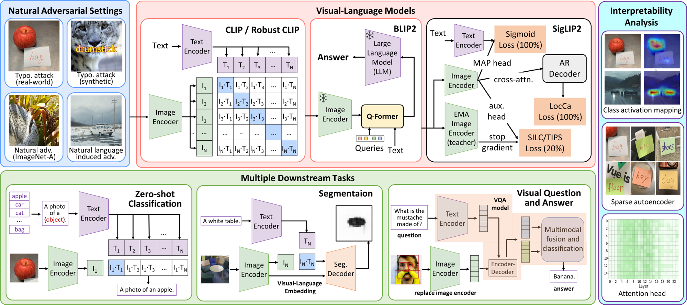

# Beyond Standard Benchmarks: A Systematic Audit of Vision-Language Model's Robustness to Natural Semantic Variation Across Diverse Tasks

> ICPR 2026 | [Paper](https://arxiv.org/abs/2604.04473v1) | [Project Page](#)

## Overview

This repository provides a systematic evaluation framework for **Vision-Language Models (VLMs)** under natural adversarial scenarios, covering three downstream tasks:

- **Zero-Shot Image Classification**
- **Semantic Segmentation**
- **Visual Question Answering (VQA)**

We evaluate 22 models across 7 families (CLIP, Robust CLIP, SigLIP2, BLIP2, PaLiGemma2) against three natural adversarial scenarios:

| Scenario | Description |
|---|---|
| **Typographic Attacks** | Overlaid misleading text on images (real-world RTA-100 & synthetic ImageNet-typo) |
| **Natural Adversarial Examples** | Inherently hard real images that fool models (ImageNet-A) |
| **Language-Induced Adversarial** | AI-generated images from semantically misleading prompts (LangAdv) |



---

## Key Findings

1. **Robust CLIP underperforms standard CLIP** under natural adversarial conditions — adversarial fine-tuning on synthetic perturbations does not generalize.
2. **CLIP's cross-modal alignment is fragile** to subtle linguistic variation (LangAdv accuracy drops to ~38%).
3. **SigLIP2 achieves the best overall robustness** across all tasks and adversarial settings.
4. **BLIP2-FLAN-T5 variants** are more resilient than BLIP2-OPT under typographic and language attacks.

---

## Repository Structure

```
natural_adversarial_eval/
│
├── configs/                    # YAML configs for each experiment
│   ├── classification.yaml
│   ├── segmentation.yaml
│   └── vqa.yaml
│
├── datasets/                   # Dataset loading and adversarial construction
│   ├── __init__.py
│   ├── imagenet.py             # ImageNet-1K / ImageNet-A / ImageNet-typo
│   ├── rta100.py               # Real-world Typographic Attack dataset
│   ├── phrasecut.py            # PhraseCut for segmentation
│   ├── vqav2.py                # VQA-v2 dataset
│   ├── langadv.py              # Language-induced adversarial generation
│   └── typographic.py          # Synthetic typographic attack generator
│
├── models/                     # Model wrappers for each VLM family
│   ├── __init__.py
│   ├── clip_model.py           # OpenAI CLIP + timm ResNet CLIP
│   ├── robust_clip.py          # FARE / TeCoA robust CLIP variants
│   ├── siglip2.py              # SigLIP2 family
│   ├── blip2.py                # BLIP2 (T5 / OPT)
│   └── paligemma2.py           # PaLiGemma2 (SigLIP-So400m + Gemma2)
│
├── tasks/                      # Task-specific evaluation logic
│   ├── __init__.py
│   ├── classification.py       # Zero-shot image classification
│   ├── segmentation.py         # Semantic segmentation via CLIPSeg / adapters
│   └── vqa.py                  # VQA via CLIP-ViL / BLIP2 / PaLiGemma2
│
├── interpretability/           # Interpretability analysis tools
│   ├── __init__.py
│   ├── cam.py                  # Class Activation Mapping (Transformer CAM)
│   ├── sae.py                  # Sparse Autoencoder feature analysis
│   └── attention_head.py       # Attention head masking & visualization
│
├── scripts/                    # Entry-point scripts
│   ├── run_classification.py
│   ├── run_segmentation.py
│   ├── run_vqa.py
│   ├── run_interpretability.py
│   └── generate_langadv.py     # LangAdv dataset construction
│
├── results/                    # Output directory (auto-created)
│
├── requirements.txt
└── README.md
```

---

## Installation

```bash
git clone https://github.com/kenan976431/natural_adversarial_eval.git
cd natural_adversarial_eval
pip install -r requirements.txt
```

### Requirements

```
torch>=2.1.0
torchvision>=0.16.0
transformers>=4.40.0
open_clip_torch>=2.24.0
timm>=0.9.0
datasets>=2.18.0
Pillow>=10.0.0
numpy>=1.24.0
scipy>=1.11.0
scikit-learn>=1.3.0
matplotlib>=3.7.0
tqdm>=4.66.0
pyyaml>=6.0
einops>=0.7.0
```

---

## Datasets

| Dataset | Task | Download |
|---|---|---|
| ImageNet-1K | Classification | [HuggingFace](https://huggingface.co/datasets/imagenet-1k) (requires auth) |
| ImageNet-A | Classification | [HuggingFace](https://huggingface.co/datasets/Benjamin-eecs/imagenet-a) |
| RTA-100 | Classification / VQA / Seg | [GitHub](https://github.com/azuma164/Defense-Prefix) |
| PhraseCut | Segmentation | [Official](https://people.cs.umass.edu/~smaji/phrasecut/) |
| VQA-v2 | VQA | [HuggingFace](https://huggingface.co/datasets/HuggingFaceM4/VQAv2) |
| LangAdv | All | Auto-generated (see [LangAdv Generation](#langadv-generation)) |

All datasets except ImageNet-1K can be automatically downloaded via HuggingFace in the code.

---

## Models

All models are loaded automatically via HuggingFace Hub or `open_clip`:

| Family | Model IDs |
|---|---|
| OpenAI CLIP | `openai/clip-vit-base-patch16`, `openai/clip-vit-base-patch32`, `openai/clip-vit-large-patch14` |
| timm ResNet CLIP | `timm/resnet50-clip` via `open_clip` |
| Robust CLIP (FARE/TeCoA) | [Schlarmann et al. 2024](https://github.com/chs20/RobustVLM) checkpoints |
| SigLIP2 | `google/siglip2-base-patch16-224`, `google/siglip2-large-patch16-256`, etc. |
| BLIP2 | `Salesforce/blip2-flan-t5-xl`, `Salesforce/blip2-opt-2.7b`, etc. |
| PaLiGemma2 | `google/paligemma2-3b-pt-224`, `google/paligemma2-10b-pt-448` |

---

## Quick Start

### 1. Zero-Shot Image Classification

```bash
python scripts/run_classification.py \
    --model clip \
    --model-id openai/clip-vit-base-patch16 \
    --dataset imagenet-a \
    --output-dir results/classification/
```

Evaluate all models on all datasets at once:

```bash
python scripts/run_classification.py --all
```

### 2. Semantic Segmentation

```bash
python scripts/run_segmentation.py \
    --model siglip2 \
    --model-id google/siglip2-base-patch16-224 \
    --dataset phrasecut \
    --output-dir results/segmentation/
```

### 3. Visual Question Answering

```bash
python scripts/run_vqa.py \
    --model blip2 \
    --model-id Salesforce/blip2-flan-t5-xl \
    --dataset vqav2 \
    --output-dir results/vqa/
```

### 4. Interpretability Analysis

```bash
# GradCAM visualization
python scripts/run_interpretability.py \
    --method cam \
    --model clip \
    --model-id openai/clip-vit-large-patch14 \
    --dataset imagenet-typo \
    --num-samples 20

# Attention head masking
python scripts/run_interpretability.py \
    --method attention-head \
    --model clip \
    --model-id openai/clip-vit-large-patch14 \
    --dataset rta100
```

---

## LangAdv Generation

We provide a script to reproduce the language-induced adversarial dataset using a genetic algorithm over Z-Image prompts:

```bash
python scripts/generate_langadv.py \
    --classes cat dog bird horse cow \
    --num-variants 20 \
    --generations 8 \
    --mutation-prob 0.01 \
    --output-dir datasets/langadv/
```

> ⚠️ **Note:** Image generation requires access to an image generation API. By default the script calls the Z-Image API ([arXiv:2511.22699](https://arxiv.org/abs/2511.22699)). You can substitute any compatible generator by implementing the `BaseImageGenerator` interface in `datasets/langadv.py`.

---

## Reproducing the Paper's Results

A full sweep across all 22 models and all adversarial datasets:

```bash
# Edit configs/classification.yaml to set your data paths, then:
python scripts/run_classification.py --config configs/classification.yaml --all

python scripts/run_segmentation.py --config configs/segmentation.yaml --all

python scripts/run_vqa.py --config configs/vqa.yaml --all
```

Results are saved as JSON in `results/` and a radar-plot summary (matching Fig. 1 in the paper) can be generated with:

```bash
python scripts/plot_radar.py --results-dir results/
```

---

## Citation

```bibtex
@inproceedings{chengyu2026beyond,
  title     = {Beyond Standard Benchmarks: A Systematic Audit of Vision-Language Model's Robustness to Natural Semantic Variation Across Diverse Tasks},
  author    = {Jia Chengyu and AprilPyone MaungMaung and Huy H. Nguyen and Jinyin Chen and Isao Echizen},
  booktitle = {International Conference on Pattern Recognition (ICPR)},
  year      = {2026}
}
```

---

## Acknowledgements

This work was partially supported by JSPS KAKENHI Grants JP21H04907, JP24H00732, and 25K21280, JST CREST Grant JPMJCR20D3 and JPMJCR2562, JST AIP Acceleration Grant JPMJCR24U3, and JST K Program Grant JPMJKP24C2 Japan.

We build upon [OpenCLIP](https://github.com/mlfoundations/open_clip), [BLIP-2](https://github.com/salesforce/LAVIS), [CLIPSeg](https://github.com/timojl/clipseg), and [RobustVLM](https://github.com/chs20/RobustVLM).
